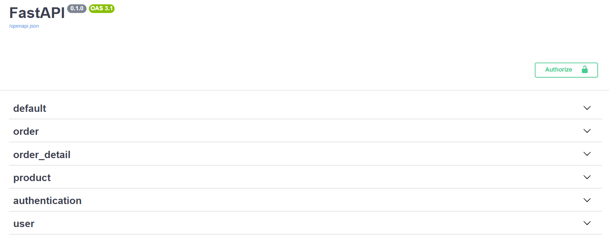
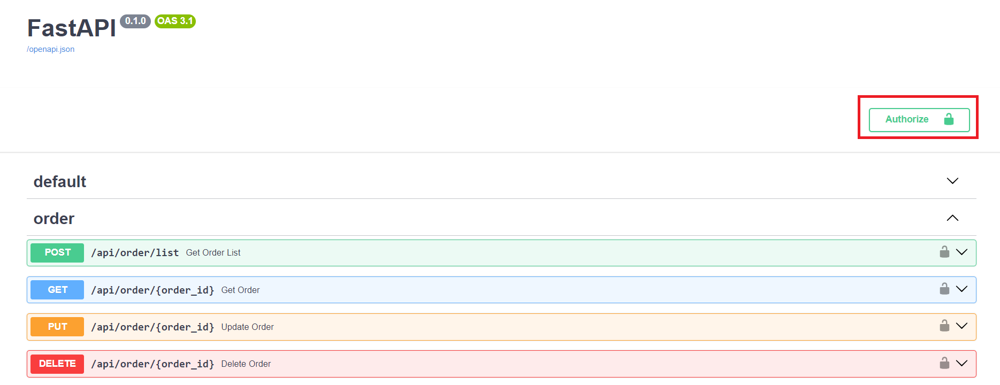
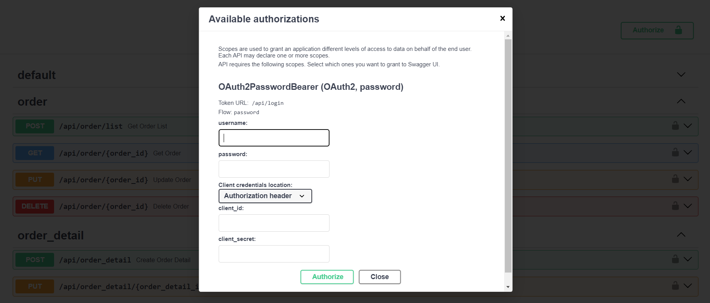
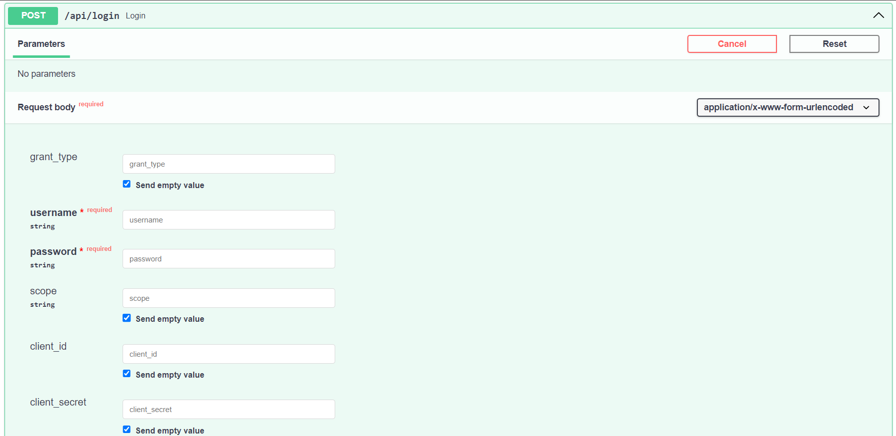

# E-commerce

## Introduction
This is a `E_commerce` project to implement an API Service that run RESTful API, DB migration and test.

To run the project locally, just execute `docker-compose -f docker-compose-local.yml up`.

## Project Architecture
```
.
├── bin                # Scripts.
├── migration          # Database migration configuration files.
├── res                # Place for configuration-related files.
├── docker_entrypoint  # A folder for Docker-related shell scripts, serving as entry points for operations
├── test               # Folder for test code, including unit and integration tests.
└── src                # Entry point of the project.
    ├── repository     # Manages database operations.
    │   ├── error_code # The erro code from database operations.
    │   └── model      # Contains database models.
    ├── restful_api    # Implements RESTful web services.
    │   ├── handler    # Processes RESTful API requests and responses.
    │   └── schema     # Defines the structure for RESTful API requests and responses.
    ├── service        # Contains business logic programs.
    │   └── model      # Holds the models used by the service layer.
    ├── seed           # Scripts or files for seeding the database with initial data upon setup.
    └── util           # Tools and utilities related to development.

```
### Entrypoint
> The entrypoint for the project is located within the `src` folder.

To properly set up the environment, it is necessary to add a `.env` file that configures the environment variables as follows:
```
PYTHONPATH=./src:./test:$PYTHONPATH
```

## DB Migration
### Prerequisites
Ensure the migration folder has been initialized using the following command:
```
alembic init migration
```
### Create a New Revision
1. Define database changes by ORM models located under `src/repository/model`.
2. In the `__init__.py` under `src/repository/model`, manually import your ORM modules for Alembic to reference.
3. Use the following Alembic command to create a new revision:
   -  **Usage**
        ```
        alembic -x config_path={project_config_path} revision --autogenerate -m {revision_message}
        ```
   -  **Example**
        ```
        alembic -x config_path=./res/config.yml revision --autogenerate -m "Init table"
        ```
### Update Database to a Target Revision
1. In `config.yml`, update the `DB_MIGRATION_REVISION` variable with the target version.
   -  **Example**
        ```
        DB_MIGRATION_REVISION: head         # Upgrade to the latest revision
        DB_MIGRATION_REVISION: base         # Downgrade to the initial revision
        DB_MIGRATION_REVISION: "+1"         # Upgrade to the next revision
        DB_MIGRATION_REVISION: "-1"         # Downgrade to the last revision
        DB_MIGRATION_REVISION: 6dcc4580e67e $ Update to a specified revision
        ```
2. Run `run_db_migration.py` to update the database to the specified version:
   -  **Usage**
        ```
        python ./bin/run_db_migration.py --config_path={project_config_path}
        ```
   -  **Example**
        ```
        python ./bin/run_db_migration.py --config_path=./res/config.yml
        ```
### Merge Multiple Revisions into One
1. Identify all the manually created migration code (not generated by autogenerate) which is outside the Alembic autogenerated comments. For example:
   ```python
    def downgrade() -> None:
    # ### commands auto generated by Alembic - please adjust! ###
    op.drop_table("users")
    op.drop_table("role_permissions")
    # ### end Alembic commands ###
    sa.Enum(name="role_name_enum").drop(op.get_bind(), checkfirst=False)       # <-- manually created
    sa.Enum(name="permission_name_enum").drop(op.get_bind(), checkfirst=False) # <-- manually created
   ```
2. Determine the revision that will serve as the base for the new merged revision.
3. Delete all the migration revisions created after this base revision.
4. Follow the steps in **Create a New Revision** to generate a new merged revision.
5. Manually add back all the manually created code identified in step 1.

## Run Project Locally

### Prerequisites

When we develop locally, we need the fundamental services, such as database. Here's how we launch it locally via docker-compose.

`docker- ompose -f docker-compose-local.yml up timescaledb db_migration`

This command will run timescaledb with latest version of DB schema.

### Clone project
```
git clone https://github.com/pili2026/e_commerce_work.git
cd e_commerce_work
```
### Run the web server only by docker-compose
`docker-compose -f docker-compose-local.yml up web_api_server`
### Run the web server only by Debug mode
*  Install related packages:
```
pip install -r requirements.txt
```
* Run by command
```
PYTHONPATH=./src:./test:$PYTHONPATH src/app
```
### Interactive API docs
Navigate to `http://{ip_address}:8000/docs` to see the automatic interactive API documentation (provided by Swagger UI).


Some APIs require **authentication (login)** to obtain a **token** before they can be used, such as operations related to orders.

#### Authentication
When the service is started via Docker Compose, two users will be created by default.
```
Role: manager
Account: manager
Password: manager1234
---------------------
Role: customer
Account: customer
Password: customer1234
```
Authentication can be done in two ways:
1. API docs authentication
2. Call the login API
##### API docs authentication
1. Select Authorize

2. Input username(account) and password to login

##### Call the login API
1. Input username(account) and password to login

2. Get a token to operate the API.

Afterwards, you can perform operations with the corresponding permissions in the API documentation.


### Run unit test
* Install related packages:
```
pip install -r requirements-dev.txt
```
* Execute testing by vscode


## Pylint
### Setting in VSCode
1. Find the path of the `pylint` command
```
which pylint
```

2. Set the parameter in the `./vscode/settings.json`
```json
{
    "pylint.path": [
        "{pylint_path}"
    ]
}
```
### Change Pylint Config
1. Modify the `.pylintrc` file
2. Restart the `pylint` server by command palette
> **NOTE:** To disable `pylint` options, please modify the `[MESSAGES CONTROL]` section in the `.pylintrc` file.
   e.g. To disable the `logging-fstring-interpolation option`, you can append this option at the end of the disable variable as blow
   ```
   disable=raw-checker-failed,
        bad-inline-option,
        locally-disabled,
        file-ignored,
        suppressed-message,
        useless-suppression,
        deprecated-pragma,
        use-symbolic-message-instead,
        use-implicit-booleaness-not-comparison-to-string,
        use-implicit-booleaness-not-comparison-to-zero,
        missing-module-docstring,
        missing-class-docstring,
        missing-function-docstring,
        global-statement,
        logging-fstring-interpolation <-------
   ```


## Black
### Setting in VSCode
1. Find the path of the `black` command
```
which black
```

2. Set the parameters in the `./vscode/settings.json`
```
{
    "[python]": {
        "editor.defaultFormatter": "ms-python.black-formatter",
    },
    "black-formatter.path": [
        "{black_path}"
    ]
}
```
### Change Black Config
1. Modify the `pyproject.toml` file
2. Restart the `black` server by command palette